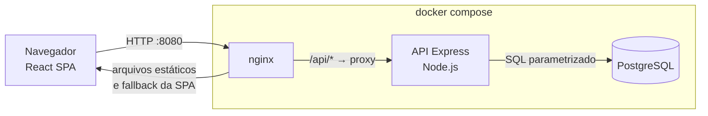
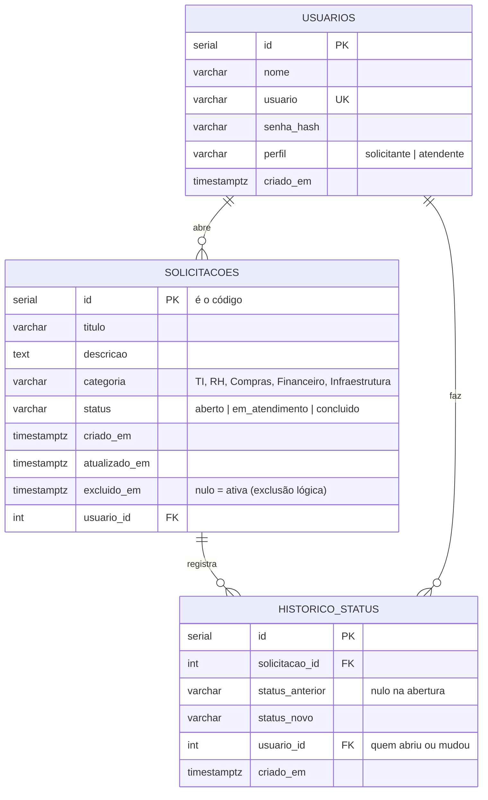

# Memorial Técnico de Desenvolvimento

**Projeto:** Portal de Solicitações Internas  
**Contexto:** 2ª etapa do processo seletivo para Desenvolvedor(a) de Sistemas Júnior, bit Soluções  
**Autor:** Hiago Kalil  
**Repositório:** https://github.com/hiagoka/portal-solicitacoes-internas

Este documento explica *como* e *por que* o sistema foi construído da forma que foi. A visão geral e as instruções de execução
estão no [README](../README.md); cada decisão individual, com seu contexto e alternativas, está no
[registro de decisões](decisoes.md) (71 entradas, citadas aqui como "decisão NNN").

## Sumário

1. [Visão geral e abordagem](#1-visão-geral-e-abordagem)
2. [Tecnologias utilizadas](#2-tecnologias-utilizadas)
3. [Justificativa técnica por tecnologia](#3-justificativa-técnica-por-tecnologia)
4. [Justificativa conceitual](#4-justificativa-conceitual)
5. [Qualidade, testes e o que eles revelaram](#5-qualidade-testes-e-o-que-eles-revelaram)
6. [Análise crítica](#6-análise-crítica)

---

## 1. Visão geral e abordagem

O desafio pede um portal em que colaboradores registram demandas internas e acompanham sua evolução, com autenticação,
CRUD de solicitações, listagem com filtros e um dashboard. A stack era livre; o que se avalia é a capacidade de estruturar
uma aplicação completa, modelar dados, expor uma API consistente, construir uma interface utilizável, aplicar boas práticas
e **justificar as escolhas**.

**Abordagem em cinco pontos:**

1. **Planejar antes de codar.** O trabalho foi dividido em 135 tarefas pequenas e verificáveis, agrupadas em 17 fases
   ([`PLANEJAMENTO.md`](PLANEJAMENTO.md)). Cada tarefa vira, em geral, um commit.
2. **Camadas com uma responsabilidade cada**, no backend e no frontend, para que regras de negócio, acesso a dados e
   apresentação possam mudar de forma independente.
3. **Decidir com registro.** Cada escolha relevante foi anotada na hora, com alternativas e motivo
   ([`decisoes.md`](decisoes.md)). Este memorial é uma síntese desse registro, não uma reconstrução de memória.
4. **Testar de verdade, em camadas.** Testes de regras puras, testes de integração contra um PostgreSQL real e testes de
   navegador contra o sistema empacotado. Boa parte dos defeitos reais só apareceu na camada mais externa (seção 5).
5. **Entregar executável sem adaptações.** `docker compose up --build` sobe banco, API e interface a partir de um clone limpo.

**Interpretações do enunciado** (o texto deixa pontos em aberto; as escolhas foram registradas nas decisões 002 e 015):

- Quem altera o status? O enunciado só diz "alterar status". Foram criados **dois perfis**: *solicitante* (gerencia só as
  suas solicitações) e *atendente* (vê todas e altera o status). Isso também demonstra controle de acesso.
- "Editar e excluir solicitação aberta" foi lido como: somente o **autor**, e somente enquanto o status for *Aberto*.
- O "código" da solicitação é o identificador do banco, exibido como `#0001`.
- O filtro de período considera a **data de abertura**, no dia do fuso de Brasília.

**Dimensão do que foi entregue**

| Item | Quantidade |
|---|---|
| Código de produção (backend + frontend + SQL) | ≈ 3.500 linhas |
| Código de teste (backend, frontend e E2E) | ≈ 1.900 linhas |
| Testes automatizados | 164 (API) + 84 (frontend) + 177 verificações em navegador real |
| Commits | mais de 190, em padrão *Conventional Commits* |
| Decisões documentadas | 65 |

---

## 2. Tecnologias utilizadas

| Categoria | Tecnologia | Versão | Papel no projeto |
|---|---|---|---|
| Linguagem | TypeScript | 7.0 (backend), 6.0 (frontend) | Código do backend e do frontend |
| Linguagem | SQL (PostgreSQL) | — | Esquema, dados de demonstração e todas as consultas |
| Runtime | Node.js | 22 (imagens e CI); validado também em 25 | Execução da API e das ferramentas |
| Banco de dados | PostgreSQL | 16 | Persistência |
| Driver | `pg` (node-postgres) | 8.23 | Acesso ao banco, com *pool* de conexões |
| Framework backend | Express | 5.2 | API REST |
| Validação | Zod | 4.6 | Entrada da API, variáveis de ambiente |
| Autenticação | `bcryptjs` / `jsonwebtoken` | 3.0 / 9.0 | Hash de senha / token de sessão |
| Segurança | `express-rate-limit`, `cors`, `cookie-parser` | 8.7 / 2.8 / 1.4 | Limite de tentativas de login, CORS, leitura do cookie |
| Biblioteca de UI | React | 19.3 | Interface |
| Build/dev frontend | Vite | 8.3 | Servidor de desenvolvimento e empacotamento |
| Estilo | Tailwind CSS | 4.3 | Estilização por utilitários, lendo o tema único |
| Roteamento | React Router | 8.4 | Navegação, rotas protegidas |
| Testes (unidade e API) | Vitest, Supertest | 4.1 / 7.3 | 164 testes de API, 84 de frontend |
| Testes (navegador) | `puppeteer-core`, axe-core | 24.43 / 4.13 | 177 verificações, incluindo acessibilidade |
| Qualidade estática | `tsc` (modo estrito), oxlint | — / 1.81 | Tipos e lint |
| Containerização | Docker, Docker Compose | — | Empacotamento e orquestração |
| Servidor web | nginx | 1.27 | Serve a interface e faz proxy reverso de `/api` |
| CI/CD | GitHub Actions | actions v7 | Build e testes a cada push |
| Controle de versão | Git / GitHub | — | Histórico, *Conventional Commits* |

Não há serviços em nuvem: o sistema roda inteiro em contêineres locais, e o GitHub Actions é usado apenas para o CI.

---

## 3. Justificativa técnica por tecnologia

Para cada tecnologia: **motivo** da escolha, **benefícios** para este cenário, **vantagens sobre alternativas** conhecidas e
**impacto** na manutenção, escalabilidade ou produtividade.

### PostgreSQL

- **Motivo:** o domínio é relacional (usuários e solicitações ligados por chave estrangeira) e precisa de integridade.
- **Benefícios:** restrições (`CHECK`, `FOREIGN KEY`, `UNIQUE`) garantem as regras mesmo que a aplicação tenha um defeito;
  `TIMESTAMPTZ` guarda instantes sem ambiguidade de fuso; consultas agregadas (`GROUP BY`) servem o dashboard em uma passada.
- **Versus alternativas:** SQLite seria mais simples de rodar, mas é um dialeto diferente do usado em produção e não permite
  conexões concorrentes reais; MySQL é equivalente aqui, porém o PostgreSQL tem `ILIKE`, `TIMESTAMPTZ` e conversão de fuso
  nativos; bancos de documentos (MongoDB) perderiam a integridade referencial sem ganho para um modelo tão estruturado.
- **Impacto:** escalável verticalmente e com réplicas de leitura; amplamente suportado em ambientes corporativos.

### SQL escrito à mão (driver `pg`), sem ORM — decisão 001

- **Motivo:** o enunciado pede scripts SQL de criação e dicionário de dados; com SQL direto o `schema.sql` **é** o que roda,
  e as consultas ficam visíveis e explicáveis.
- **Benefícios:** controle total sobre filtros dinâmicos, junções, paginação e a condição atômica
  `UPDATE … WHERE status = 'aberto'`; nenhuma camada escondendo o que vai ao banco.
- **Versus alternativas:** Prisma/TypeORM geram migrações e tipos automaticamente (mais produtividade em modelos grandes),
  mas ocultariam justamente o que se quer demonstrar e adicionariam peso e uma camada de abstração para duas tabelas.
- **Impacto:** exige disciplina: todos os valores vão em parâmetros (`$1`, `$2`…), nunca concatenados (decisão 020). Em um
  sistema com dezenas de tabelas, uma ferramenta de migrações passaria a compensar (seção 6).

### Node.js e TypeScript — decisão 003

- **Motivo:** uma única linguagem no backend e no frontend, tipagem estática e um ecossistema que cobre todo o projeto.
- **Benefícios:** o TypeScript em modo estrito pega erros de tipo antes de rodar e documenta o contrato entre camadas; o mesmo
  vocabulário de tipos (`Solicitacao`, `Status`) aparece dos dois lados.
- **Versus alternativas:** Java/Spring ou C#/.NET são opções corporativas robustas, porém exigiriam mais configuração e código
  de base para este escopo; Python/FastAPI é produtivo, mas separaria as linguagens de back e front.
- **Impacto:** onboarding rápido para quem já domina JavaScript; trade-off é a ausência de um padrão arquitetural imposto
  (que aqui foi substituído por uma estrutura de camadas explícita).

### Express 5 — decisão 003

- **Motivo:** simples, maduro e muito documentado; deixa a organização em camadas explícita em vez de impô-la.
- **Benefícios:** a versão 5 encaminha erros de funções `async` ao *middleware* de erro sem `try/catch` em cada rota, o que
  simplifica os controladores.
- **Versus alternativas:** NestJS entrega estrutura pronta (módulos, injeção de dependências) mas traz muitos conceitos para
  um escopo pequeno; Fastify é mais rápido, porém com comunidade e exemplos menores.
- **Impacto:** fácil de manter por qualquer pessoa que conheça Node; para um sistema muito maior, a falta de estrutura
  imposta exigiria convenções rígidas de equipe.

### Zod — decisão 005

- **Motivo:** validar a entrada **e** derivar o tipo TypeScript da mesma definição.
- **Benefícios:** uma fonte única para validação e tipo; mensagens em português (`z.locales.pt()`); usado também para validar
  as variáveis de ambiente na inicialização, de modo que a aplicação falha cedo e com mensagem clara.
- **Versus alternativas:** Joi e Yup não inferem tipos tão diretamente; validação manual é repetitiva e sujeita a esquecimentos.
- **Impacto:** reduz código e divergência entre o que a API aceita e o que o código assume.

### `bcryptjs` — decisão 004

- **Motivo:** armazenar senhas com hash lento e *salt* (bcrypt, custo 10).
- **Benefícios:** implementação em JavaScript puro, sem compilar módulos nativos: as imagens Docker Alpine e o CI constroem
  sem toolchain.
- **Versus alternativas:** `bcrypt` nativo é mais rápido, mas exige compilação; `argon2` é o algoritmo mais moderno, também
  nativo. A diferença de desempenho é irrelevante nesta escala.
- **Impacto:** build mais simples e portátil; em produção com carga alta, avaliar `argon2`.

### Sessão: JWT em cookie `HttpOnly` — decisões 009, 011, 012

- **Motivo:** o navegador envia o cookie sozinho, e o JavaScript da página **nunca** enxerga o token.
- **Benefícios:** reduz o risco de roubo do token por XSS; sem estado no servidor, o que simplifica o Docker e a implantação.
- **Versus alternativas:** token em `localStorage` é legível por qualquer script da página; sessões em servidor (com Redis)
  permitem revogação imediata, ao custo de mais infraestrutura.
- **Impacto:** o preço do JWT sem estado é que a revogação imediata não é possível (seção 6). Para mitigar, cada requisição
  reconsulta o usuário no banco, então remover um usuário encerra seu acesso na hora.

### `express-rate-limit` — decisões 013 e 051

- **Motivo:** dificultar adivinhação de senha por força bruta.
- **Benefícios:** custo mínimo; conta apenas tentativas **falhas** (10 por IP a cada 15 min), para que o uso normal num
  escritório, onde muitos colaboradores saem do mesmo IP, nunca bloqueie ninguém.
- **Versus alternativas:** bloqueio por conta (protege melhor contra ataques distribuídos, mas permite negar acesso a um
  usuário alheio); limite no gateway/WAF (ideal em produção).
- **Impacto:** o contador fica em memória; com várias réplicas da API seria preciso um armazenamento compartilhado.

### React 19 e TypeScript no frontend — decisão 029

- **Motivo:** componentização, ecossistema e tipagem compartilhada com o backend.
- **Benefícios:** a interface é uma composição de componentes pequenos (o maior arquivo `.tsx` tem 88 linhas) e reutilizáveis.
- **Versus alternativas:** Vue e Svelte são igualmente capazes; Next.js traria renderização no servidor, desnecessária para um
  portal interno autenticado.
- **Impacto:** grande base de conhecimento e bibliotecas; exige disciplina para separar apresentação, dados e regras
  (seção 4.2).

### Vite — decisão 029

- **Motivo:** *build* e recarga a quente rápidos, configuração mínima.
- **Versus alternativas:** Create React App está descontinuado; Webpack é mais configurável porém mais lento e verboso.
- **Impacto:** feedback de desenvolvimento quase instantâneo e *bundle* de produção enxuto (≈ 92 kB comprimido).

### Tailwind CSS 4 com tema centralizado — decisão 030

- **Motivo:** estilizar sem folhas de CSS paralelas e manter o visual consistente.
- **Benefícios:** todas as cores, fontes, raios e sombras vivem em **um arquivo** (`styles/theme.ts`), com duas paletas
  (claro e escuro) de mesmas chaves; o Tailwind as lê e gera variáveis CSS. Os componentes usam só nomes semânticos
  (`bg-surface`, `text-textMuted`), então o modo escuro não exige `dark:` espalhado. A paleta padrão do Tailwind foi removida
  e um script (`check:cores`) falha se aparecer cor solta.
- **Versus alternativas:** CSS Modules ou CSS próprio repetem valores e variações; bibliotecas como MUI entregam visual
  pronto, mas escondem as decisões de design e pesam no *bundle*.
- **Impacto:** trocar a identidade visual é editar um arquivo. Contrapartida: sem `tailwind-merge`, sobrescrever classes por
  `className` é traiçoeiro (decisão 064), então variações viraram *props* dos componentes.

### React Router — decisão 038

- **Motivo:** roteamento declarativo e rotas aninhadas.
- **Benefícios:** `ProtectedRoute` e `AppLayout` aninhados deixam claro quais telas exigem login e compartilham moldura.
- **Impacto:** o destino pedido antes do login é preservado quando faz sentido (link aberto sem sessão, sessão expirada)
  e descartado depois de um "Sair" voluntário (decisão 050).

### Vitest, Supertest, Puppeteer e axe-core — decisões 026, 034, 057, 063

- **Motivo:** cada camada de teste pega uma classe de erro diferente.
- **Benefícios:** Vitest roda TypeScript direto e é rápido; Supertest exercita a API HTTP real contra um PostgreSQL de teste
  (sem mocks do banco, porque as regras mais importantes vivem nas consultas); Puppeteer dirige um Chrome real; axe-core
  audita acessibilidade (WCAG 2.2 AA) automaticamente.
- **Versus alternativas:** mocks do banco não provam o SQL; Playwright e Cypress são mais completos, porém baixam navegadores
  ou são mais pesados. `puppeteer-core` usa o Chrome já instalado.
- **Impacto:** os testes de navegador são mais lentos (alguns minutos no total), compensado por rodarem só depois dos baratos no CI.

### Docker, Docker Compose e nginx — decisões 052 a 055

- **Motivo:** o avaliador precisa executar o sistema "sem adaptações".
- **Benefícios:** um comando sobe banco, API e interface; o banco é inicializado pelos próprios scripts SQL do projeto; imagens
  *multi-stage* enxutas, com a API rodando sem privilégios de root. O nginx serve a interface e repassa `/api` ao backend:
  uma só origem para o navegador, sem CORS, e o cookie de sessão funciona em qualquer endereço.
- **Versus alternativas:** instalar e configurar manualmente cada peça (há instruções no README, mas é mais frágil); servir o
  frontend pelo próprio Node (acopla duas responsabilidades).
- **Impacto:** ambientes idênticos entre desenvolvimento, CI e entrega. Verificado a partir de um clone limpo: sistema saudável
  em cerca de 40 segundos.

### GitHub Actions — decisões 056 a 059

- **Motivo:** garantir que o repositório sempre builda e passa nos testes.
- **Benefícios:** três jobs (backend, frontend e ponta a ponta), com os baratos primeiro; o E2E sobe a mesma stack Docker que
  será entregue.
- **Impacto:** o primeiro CI real encontrou um defeito que a simulação local não encontrou (decisão 059), o que justifica a
  prática de rodar tudo também num ambiente limpo e diferente do da máquina de desenvolvimento.

---

## 4. Justificativa conceitual

### 4.1 Estrutura geral

Uma aplicação de página única (SPA) em React conversa, por HTTP/JSON, com uma API REST em Node, que persiste em PostgreSQL.
Em execução empacotada, o navegador fala somente com o nginx.



Três contêineres, cada um com uma responsabilidade: `frontend` (nginx), `backend` (API) e `db` (PostgreSQL). Em desenvolvimento,
o Vite (porta 5173) substitui o nginx e a interface chama a API diretamente, com CORS liberado para essa origem.

### 4.2 Organização das camadas

**Backend** — o fluxo de uma requisição atravessa camadas de responsabilidade única (decisão 006):

```
rota → middlewares → controller → service → repository → PostgreSQL
```

| Camada | Responsabilidade | Não faz |
|---|---|---|
| `routes/` | Mapa de URLs e a cadeia de *middlewares* de cada rota | Lógica de negócio |
| `middlewares/` | Autenticar, exigir perfil, validar entrada, limitar tentativas, tratar erros | Acessar dados |
| `controllers/` | Traduzir HTTP ↔ serviços (ler parâmetros validados, escolher o status HTTP) | Regras de negócio |
| `services/` | **Regras de negócio**: visibilidade por perfil, "só o autor edita", "só se aberta", transições de status | Conhecer HTTP ou SQL |
| `repositories/` | **Todo o SQL**; converte linhas do banco (`snake_case`) para o formato da API (`camelCase`) | Decidir regras |

O benefício prático: a regra "só edita enquanto aberta" mora em um lugar (o *service*) e pode ser testada sem HTTP; o SQL mora em
outro e pode ser ajustado sem tocar nas regras. `app.ts` (monta o Express) é separado de `server.ts` (abre a porta), o que
permite aos testes importar o aplicativo sem ocupar uma porta (decisão 007).

**Frontend** — a mesma ideia de camadas (decisão 032):

| Camada | Responsabilidade |
|---|---|
| `pages` | Apenas **montam a tela**; sem busca de dados nem regras |
| `hooks` | Estado e busca de dados (`useConsulta`, `useSolicitacoes`, `useFiltrosSolicitacoes`…) |
| `services` | **Único** lugar com `fetch`; o `httpClient` trata cookies, erros tipados e sessão expirada |
| `components/ui` | 14 componentes genéricos, sem regra de negócio (Button, Input, Modal, Pagination…) |
| `features/*` | Componentes e hooks específicos de cada área (auth, solicitações, dashboard) |
| `constants` | Rótulos, categorias, rotas: nenhum texto ou caminho "solto" nos componentes |
| `styles/theme.ts` | Única fonte de cores, fontes, raios e sombras |

### 4.3 Modelagem de dados



Detalhamento completo em [`database/dicionario-de-dados.md`](../database/dicionario-de-dados.md). Escolhas que valem registro:

- **Restrições no banco, não só na aplicação.** Categoria, status e perfil têm `CHECK`; `usuario` é `UNIQUE`; `usuario_id` é chave
  estrangeira. Mesmo que um defeito na API tente gravar um valor inválido, o banco recusa (verificado manualmente com uma
  categoria inexistente).
- **Texto com `CHECK` em vez de `ENUM` do PostgreSQL:** alterar a lista de valores é uma alteração de restrição, sem a
  rigidez de tipos enumerados.
- **`TIMESTAMPTZ`** para todas as datas: o instante é absoluto, e a exibição e o filtro usam o fuso de Brasília explicitamente
  (decisões 022 e 042). Sem isso, uma solicitação aberta às 22h cairia "no dia seguinte" em UTC.
- **Índices** nas colunas filtradas ou agrupadas (`status`, `categoria`, `criado_em`, `usuario_id`).
- **`atualizado_em` mantido pela aplicação** a cada edição ou mudança de status, e documentado como tal no dicionário.
- **Exclusão lógica** (decisão 069): excluir preenche `excluido_em` em vez de apagar a linha. A solicitação some de todas as
  consultas (listagem, detalhes, busca, totais, dashboard), mas fica no banco como trilha de auditoria, e o código nunca é reaproveitado.
- **Histórico de status** (decisão 070): a tabela `historico_status` guarda um evento para a abertura e um para cada mudança, com
  quem fez e quando. O evento é gravado **na mesma transação** da operação: se o registro do histórico falhar, a operação inteira
  é desfeita. Isso foi provado em teste, quebrando de propósito a gravação do histórico e conferindo que o status não muda.
- **Três tabelas bastam.** Não foram criadas tabelas de categorias ou status: são listas fixas do enunciado, e uma tabela
  adicional só traria junções (ver 6.3).

### 4.4 Padrões de projeto utilizados

| Padrão | Onde aparece | Por quê |
|---|---|---|
| **Repository** | `backend/src/repositories/*` | Isola o SQL; o resto da aplicação não sabe como os dados são armazenados |
| **Service Layer** | `backend/src/services/*` | Centraliza as regras de negócio, independentes de HTTP |
| **Cadeia de middlewares** (*Chain of Responsibility*) | `autenticar → exigirPerfil → validar → controller` | Cada etapa decide se passa a requisição adiante ou a interrompe com um erro |
| **Fábrica de middleware** | `exigirPerfil('atendente')`, `validar(schema, 'query')` | Gera middlewares configuráveis sem duplicar código |
| **Erro de domínio tipado** | `AppError` + tratador global | Todo erro esperado vira o mesmo formato JSON; erros inesperados viram um 500 genérico, sem vazar detalhes |
| **Transação** (unidade de trabalho) | `transacao()` em `config/database.ts` | Duas gravações que precisam andar juntas (mudar o status e registrar o evento) viram uma operação: ou valem as duas, ou nenhuma |
| **Mapper (DTO)** | `paraSolicitacao` no repositório | Traduz o formato do banco para o da API em um único ponto |
| **Provider / Context** | `AuthProvider`, `ToastProvider` | Estado global de sessão e notificações sem *prop drilling* |
| **Hooks personalizados** | `useConsulta`, `useFormularioSolicitacao`… | Separam lógica de estado da apresentação e eliminam duplicação |
| **Façade** | `httpClient` e os *services* do frontend | Esconde `fetch`, cookies e tratamento de erro atrás de uma interface simples |
| **Tabelas de consulta em vez de condicionais** | `STATUS_CLASSES`, `TRANSICOES`, `STATUS_LABEL` | Regras de apresentação e de transição viram dados, fáceis de ler e testar |

Não se buscou aplicar padrões por si só: foram os que surgiram para resolver duplicação ou acoplamento reais (por exemplo, o
hook genérico `useConsulta` foi extraído quando o terceiro hook de busca ia repetir a mesma lógica — decisão 048).

### 4.5 Estratégia de autenticação e autorização

**Autenticação** (decisões 009 a 012, 014, 037, 050, 051):

1. `POST /auth/login` compara a senha com o hash `bcrypt`. Para **não revelar quais usuários existem**, a mensagem é a mesma
   para "usuário inexistente" e "senha errada", e quando o usuário não existe a senha é comparada contra um hash falso, de
   modo que o tempo de resposta também não denuncia.
2. Em caso de sucesso, a API emite um JWT (contendo o id e o perfil, validade de 8 horas) em um cookie `HttpOnly` com
   `SameSite=Lax` (e `Secure` configurável para HTTPS).
3. Cada requisição protegida passa pelo middleware `autenticar`, que valida o JWT **e reconsulta o usuário no banco**; um
   usuário removido perde acesso imediatamente, mesmo com token ainda válido.
4. No frontend, o token é inacessível ao JavaScript. A aplicação sabe se há sessão perguntando a `GET /auth/me` ao abrir.
   Qualquer `401` em rota protegida derruba o usuário ao login.
5. O limite de tentativas conta só as **falhas** (10 por IP a cada 15 minutos) e respeita o IP real atrás do nginx
   (`TRUST_PROXY`, decisão 054). Forjar o cabeçalho `X-Forwarded-For` não contorna o limite **porque o único caminho até a API é
   o nginx**, que registra o IP real: o compose não publica a porta da API e o CI falha se ela ficar exposta. Uma revisão de
   código final mostrou que, com a porta publicada, o limite seria burlável (decisão 067).

**Autorização** é em duas camadas, com responsabilidades distintas (decisão 014):

- *Quem pode usar esta rota?* → middleware `exigirPerfil` (por exemplo, só o atendente altera status).
- *Quem pode agir sobre este registro?* → regra de negócio no *service* (por exemplo, só o autor edita, e só se aberta).
- O solicitante que pede a solicitação de outra pessoa recebe **404**, e não 403, para não revelar que o código existe (decisão 015).
- A condição de estado vai **dentro do próprio `UPDATE`/`DELETE`** (`… AND status = 'aberto'`), de modo que a regra seja
  aplicada de forma atômica pelo banco mesmo se o status mudar entre a verificação e a gravação (decisões 016 e 023).

**Defesas complementares:** consultas sempre parametrizadas (sem concatenar entrada do usuário); curingas do `ILIKE` escapados;
campos controlados pelo servidor (status inicial, data e solicitante nunca vêm do cliente — decisão 017); validação com Zod em
todas as entradas; respostas de erro sem detalhes internos; cabeçalhos de segurança no nginx; segredos fora do código (`.env`
ignorado pelo Git, validação na inicialização); a API roda como usuário sem privilégios (não como root).

### 4.6 Comunicação entre frontend e backend

- **Estilo:** REST sobre HTTP/JSON, com recursos no plural (`/solicitacoes`), verbos HTTP com significado (`GET`, `POST`,
  `PUT`, `DELETE`, `PATCH` para a mudança de status) e códigos coerentes: `400` dados inválidos, `401` sem sessão, `403`
  sem permissão, `404` inexistente, `409` conflito de estado, `429` excesso de tentativas.
- **Formato único de erro:** `{ "erro": "...", "detalhes": [{ "campo": "...", "mensagem": "..." }] }`. O frontend mostra cada
  mensagem no campo correspondente.
- **Paginação** com `pagina` e `porPagina` (padrão 10, máximo 50), resposta com `{ solicitacoes, paginacao }`; o total é
  calculado sobre o mesmo filtro e escopo, e a ordenação é estável (decisão 060).
- **Estado da listagem na URL** (decisão 068): filtros, busca e página vivem na própria URL (`/solicitacoes?status=aberto&pagina=2`).
  O link pode ser compartilhado, recarregar mantém a tela e o botão "voltar" devolve a lista como estava; valores inválidos na URL
  são descartados em silêncio, e os cartões do dashboard são links para a lista já filtrada.
- **Cliente HTTP único** no frontend: envia o cookie (`credentials: 'include'`), converte falhas em um `ApiError` tipado
  (inclusive "sem conexão", status 0) e avisa a aplicação quando a sessão expira (decisão 033).
- **Empacotado**, o navegador usa sempre `/api` (mesma origem), então não há CORS nem dependência de `localhost`.

### 4.7 Organização do código-fonte

A estrutura completa está no [README](../README.md#estrutura-do-projeto). Princípios seguidos:

- **Um conceito por arquivo**, com nomes que dizem o que fazem; o maior componente de interface tem 88 linhas.
- **Dependências em uma direção:** páginas → hooks → serviços; nunca o contrário. Componentes genéricos (`ui/`) não conhecem
  o domínio.
- **Nada solto:** rótulos, rotas e cores centralizados em `constants/` e `styles/theme.ts`, com verificação automática de cores.
- **Imports por alias** (`@/components/ui`), com um `index.ts` em cada pasta de componentes.
- **Português no domínio** (`Solicitacao`, `diasDisponiveis`…, `usuario`, `titulo`) e inglês em termos genéricos de
  infraestrutura, acompanhando o vocabulário do enunciado.
- **Histórico de commits legível:** *Conventional Commits* (`feat`, `fix`, `test`, `docs`, `ci`…), um commit por tarefa.

### 4.8 Interface: tema, responsividade e acessibilidade

- **Tema claro e escuro** a partir de variáveis CSS; preferência do sistema na primeira visita, escolha salva depois; um script
  no `index.html` aplica o tema antes de renderizar (sem "piscar" claro).
- **Responsividade** (decisão 062): abaixo de 768 px a tabela vira cartões, os filtros ficam recolhidos e o cabeçalho passa a
  duas linhas; alvos de toque de pelo menos 40 px. Verificado a 360, 390 e 768 px: nenhuma tela com rolagem horizontal.
- **Acessibilidade medida** (decisão 063): axe-core em 13 telas e estados, nos dois temas (26 auditorias, todas sem
  violações). Além disso: link "Pular para o conteúdo", foco levado ao conteúdo a cada navegação, título da aba por página,
  rótulos ligados a campos, `aria-live` nas contagens, anel de foco global. Contraste WCAG AA garantido por teste unitário da
  paleta (36 casos).

---

## 5. Qualidade, testes e o que eles revelaram

### 5.1 Três camadas de teste

| Camada | O que cobre | Quantidade | Onde roda |
|---|---|---|---|
| Unitária (frontend) | Regras puras: permissões, validação, formatação, cliente HTTP, **contraste da paleta** | 67 | CI |
| Integração (backend) | A API de ponta a ponta (HTTP → regra → SQL → PostgreSQL **real**): permissões por perfil, transições, concorrência, filtros, paginação, validação | 134 | CI, com PostgreSQL de serviço |
| Ponta a ponta (navegador) | Fluxos reais em um Chrome real: autenticação, listagem, CRUD, dashboard, **acessibilidade (axe-core)** e **responsividade** | 160 verificações / 6 suítes | CI, contra o Docker Compose |

O banco dos testes é separado do de desenvolvimento, criado automaticamente e recriado a cada teste com os **mesmos scripts SQL**
do sistema, o que valida também o `schema.sql` e o `seed.sql`.

### 5.2 Defeitos reais que os testes acharam

Os dez primeiros vieram de testes automatizados, em geral da camada mais externa; os quatro seguintes (11 a 14), de uma **revisão de código
independente** feita ao final (decisão 067), cada um reproduzido antes de ser corrigido; o último (15), de um teste de navegador
durante as melhorias posteriores. A tabela mostra por que cada
camada, inclusive a revisão por outro par de olhos, importa.

| # | O que aconteceu | Como foi achado | Correção |
|---|---|---|---|
| 1 | `?de=01/10/2026` devolvia **500** em vez de 400: o `refine` do Zod roda mesmo quando o `regex` anterior falhou, e a data inválida lançava exceção | teste de integração (filtros) | `refine` tolerante a entradas que não são data |
| 2 | Após o login, o usuário caía no dashboard e não na página que havia pedido: o `LoginPage` redirecionava antes de o formulário navegar (corrida) | E2E (deep link) | destino pós-login calculado num hook compartilhado (decisão 038) |
| 3 | Após **sair**, o próximo login voltava à tela do usuário anterior (podendo ser uma página de contexto alheio) | E2E | só guarda a página de origem quando a sessão expira ou há link sem login (decisão 050) |
| 4 | O limite de tentativas de login contava também os **logins corretos**: dez colegas entrando do mesmo IP bloqueariam todos | E2E repetido esgotando o limite | contar só as falhas (decisão 051) |
| 5 | Atrás do nginx, o limite de login trataria todos os usuários como um só IP | revisão ao empacotar | `TRUST_PROXY`; forja de `X-Forwarded-For` testada (decisão 054) |
| 6 | O diálogo de exclusão existia no HTML até para quem não pode excluir | E2E (botão "Excluir" achado em usuário sem permissão) | só renderizar para quem pode |
| 7 | Contraste de **4,39:1** nos selos de status do tema claro (mínimo 4,5) | axe-core | tons mais escuros, calculados; teste unitário permanente (decisão 063) |
| 8 | Login sem `<main>`, título fora de ordem, página 404 sem `h1` | axe-core | marcação corrigida |
| 9 | Botão de tema espremido em ~8 px por conflito de classes do Tailwind (`px-0` contra `px-4`) | inspeção de uma captura de tela | modo `iconOnly` no `Button` (decisão 064) |
| 10 | Filtro de período falhou **apenas no CI** (campo de data depende do idioma do navegador) | primeiro CI real | datas preenchidas pelo valor interno, não digitadas (decisão 059) |
| 11 | A **API inteira caía** se o banco reiniciasse ou derrubasse uma conexão ociosa: o pool não tinha ouvinte do evento `error` | revisão de código; reproduzido derrubando as conexões | `pool.on('error')` e um teste que derruba as conexões e exige que a API continue (decisão 067) |
| 12 | **Limite de login burlável** pela porta 3000 publicada no compose combinada com `TRUST_PROXY` | revisão de código; reproduzido (12 tentativas com IP forjado, nenhum 429) | a API deixa de ser publicada; o CI verifica que a 3000 está fechada |
| 13 | Entradas hostis viravam **erro 500**: código acima do INTEGER, data com ano `0000`, caractere nulo `\u0000`, corpo acima de 100 kb | revisão de código; os 4 reproduzidos | validação no Zod, 413/415 no tratador de erros e 16 testes de entradas inválidas |
| 15 | Ao levar os filtros para a URL, o campo de busca **perdia o texto digitado** (estava controlado só pela URL, que atualiza com atraso) | teste E2E da busca | o campo tem estado local; a URL o recebe em seguida e só repõe o campo em mudanças externas (voltar/avançar) (decisão 068) |
| 14 | "Sair" com a API fora do ar **fingia** ter saído (cookie ainda válido) e `/solicitacoes/abc` consultava a API à toa | revisão de código; testes E2E vermelhos antes e verdes depois | o logout só conclui quando o servidor confirma; `useConsulta` ganhou a opção `habilitada` |

Aprendizados: (a) o teste de ponta a ponta é o que encontra defeitos de integração; (d) uma revisão independente encontra o que testes escritos pelo mesmo autor não alcançam (entradas hostis, falhas de infraestrutura e configuração insegura de implantação), e o resultado da revisão deve ser reproduzido antes de ser aceito; (b) rodar em ambiente limpo e diferente do
da máquina de desenvolvimento (outro Node, outro idioma) encontra o que o local esconde; (c) ferramentas automáticas não
substituem olhar o resultado (item 9).

---

## 6. Análise crítica

### 6.1 Limitações da solução implementada

- **Revogação de sessão.** Com JWT sem estado, o logout apaga o cookie no navegador, mas um token copiado continua válido até
  expirar (8 h). A reconsulta do usuário a cada requisição mitiga o caso de usuário removido, não o de token vazado.
- **CSRF** é mitigado por `SameSite=Lax` e por a API só aceitar JSON, mas não há token anti-CSRF dedicado.
- **Sem HTTPS nem `Content-Security-Policy`.** O compose serve HTTP; a CSP exigiria tratar o script inline do tema (nonce ou
  hash). O cookie `Secure` já é configurável (`COOKIE_SECURE`).
- **Limite de login em memória:** não é compartilhado entre réplicas da API.
- **Busca textual** (`ILIKE '%texto%'`) não usa índice; é adequada ao volume esperado, mas não escalaria para milhões de linhas.
- **Paginação por `OFFSET`:** simples e permite "ir para a página N", porém degrada em tabelas enormes (decisão 060).
- **Exclusão lógica sem restauração:** uma solicitação excluída fica no banco, mas não há tela para restaurá-la nem rotina de expurgo.
- **O histórico cobre só mudanças de status:** editar título, descrição ou categoria não gera evento.
- **Gestão de usuários inexistente na interface:** usuários vêm do `seed.sql`; não há cadastro, troca de senha nem recuperação.
- **Textos fixos em português** (sem biblioteca de internacionalização).
- **Acessibilidade verificada por ferramenta automática;** não houve teste com leitor de tela real (VoiceOver, NVDA), que
  encontra problemas de ordem de leitura e clareza que o axe não alcança.
- **Dados de demonstração e segredos padrão** no `docker-compose.yml` servem só para a demonstração.

### 6.2 Melhorias futuras

Em ordem aproximada de valor:

1. **Comentários** na solicitação (conversa entre solicitante e atendente) e **histórico também das edições** de conteúdo, completando a
   trilha de auditoria que hoje cobre só os status.
2. **Notificações** por e-mail ao mudar o status.
3. **Gestão de usuários** (cadastro, perfis, troca e recuperação de senha) e **integração com SSO** corporativo (OIDC/SAML).
4. Uma biblioteca de dados como TanStack Query (cache, revalidação) no frontend.
5. **Anexos** nas solicitações, **prazos/SLA** e **atribuição** a um atendente específico.
6. **Restauração** de solicitações excluídas (hoje só pelo banco) e uma rotina de expurgo por prazo de retenção.
7. **Documentação da API** em OpenAPI, e geração dos tipos do frontend a partir dela (hoje espelhados à mão).
8. **Testes visuais de regressão** e uma varredura de acessibilidade com leitor de tela.

### 6.3 Requisitos que poderiam ser aperfeiçoados

- O enunciado deixa em aberto **quem altera o status** e **quem pode ver o quê**; a solução adotou dois perfis, mas o ideal
  é validar a regra com o negócio (por exemplo, atendentes por categoria, supervisores, auditoria).
- **"Categorias sugeridas"** sugere uma lista que pode mudar: tratá-las como tabela administrável traria flexibilidade ao custo
  de uma junção; foi mantida a lista fixa (restrição `CHECK`) por simplicidade.
- **"Controle de sessão"** não define expiração por inatividade nem limite de sessões simultâneas.
- **"Texto livre (título)"** limita a busca ao título; buscar também na descrição seria uma extensão natural (com índice de
  texto completo).
- O **período** considera só a data de abertura; poderia haver filtro pela data de conclusão.

### 6.4 O que seria diferente em um ambiente corporativo de produção

| Tema | Hoje | Em produção |
|---|---|---|
| Esquema do banco | Scripts que recriam as tabelas | Ferramenta de **migrações versionadas** (por exemplo, `node-pg-migrate` ou Flyway), nunca `DROP TABLE` |
| Segredos | Padrões de demonstração no compose | Gerenciador de segredos (Vault, Secrets Manager); rotação de `JWT_SECRET` |
| Sessão | JWT de 8 h sem revogação | Tokens curtos + *refresh token* e/ou sessões em Redis, com revogação e controle de dispositivos |
| Transporte | HTTP | **HTTPS** obrigatório (terminado no balanceador), HSTS, `Secure` nos cookies, CSP |
| Identidade | Usuários e senhas locais | **SSO** corporativo e MFA |
| Limite de tentativas | Em memória | No gateway/WAF ou Redis; detecção de abuso |
| Observabilidade | `console` | Logs estruturados com correlação, métricas (Prometheus), rastreamento, alertas |
| Implantação | Docker Compose local | Orquestrador (Kubernetes/ECS), CD com *blue-green* ou *canary*, *health checks* de prontidão |
| Dados | Um banco, sem backup | Backups e restauração testados, réplicas de leitura, política de retenção, LGPD |
| Dependências | Atualizações manuais | Dependabot/Renovate, `npm audit`, varredura de imagens |
| Contrato da API | Tipos espelhados à mão | OpenAPI como fonte única; versionamento da API |
| Autorização | Dois perfis fixos | Modelo de papéis e permissões configurável, com auditoria |
| Testes | CI com suítes completas | Mais: testes de carga, de segurança (SAST/DAST) e ambientes de homologação |

### 6.5 Considerações finais

O objetivo foi entregar uma solução **funcional, organizada e bem justificada**, como o enunciado pede, priorizando a clareza
das camadas e a verificação automática do que foi construído. A parte mais valiosa do processo, na prática, foi a camada de
testes de navegador: ela revelou defeitos de integração e de acessibilidade que nenhuma leitura de código mostrava, e o registro
das decisões permitiu, ao final, explicar cada escolha com o seu motivo, as alternativas descartadas e as limitações
conhecidas.
